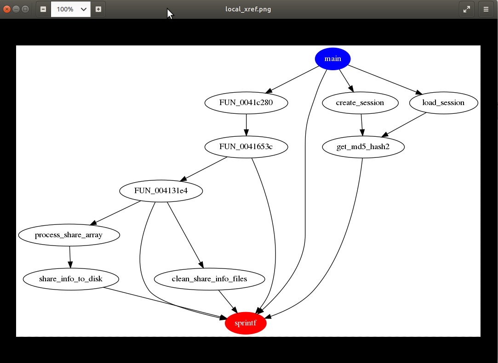
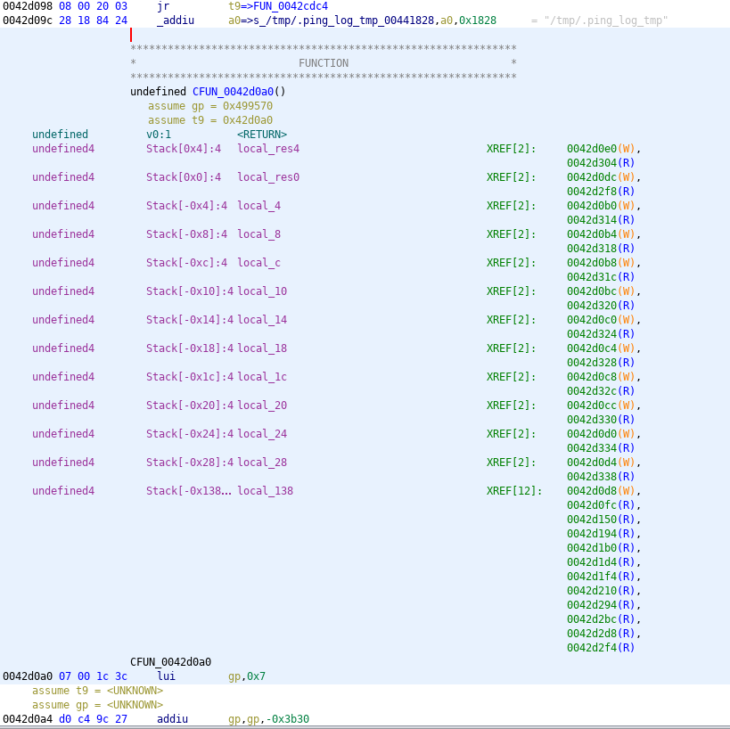
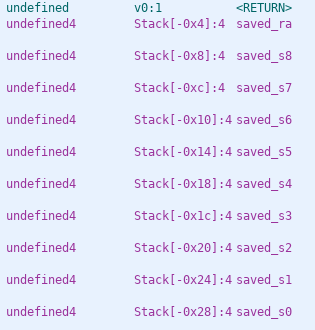

Converting IDA Plugins from [devttyS0](https://github.com/devttys0/ida) to 
Ghidra framework. To install, clone and add the script directory via Ghidra's 
Script Manager. If you check the 'In Tool' checkbox they will appear under a 
'TNS' tag. 

# Table Of Contents
[Call Chain](#call_chain) - Find call chains between two functions

[Codatify](#codatify) - Fix up code and data.

[Fluorescence](#fluorescence) - Highlight function calls.

[Function Profiler](#func_profiler) - Display cross refs from the current function.

[Local Cross References](#local_cross_ref) - Find references to items in the current function.

[MIPS Rop Finder](#mips_rop) - Find ROP gadgets in MIPS disassembly.

[Rename Variables](#rename_variables) - Rename saved stack variables.

----

# Call Chain
Display the call chain, if it exists, between two functions. The output will 
be display using a modified graphviz library as well as Ghidra's console.

----

# Codatify

## Fixup Code 
Define all undefined data in the .text section as code and covert it to a 
function if applicable.

### Before

### After

## Fixup Data (No structure detection (yet?))
Define uninitialized strings and pointers in the code. All other uninitialized
data is converted to a DWORD.

### Before 

**Data Section**

**Cross Reference**

### After

**Data Section**

**Cross Reference**

----

# Fluorescence
Highlight or un-highlight all function calls in the current binary.

----

# Function Profiler
Display all cross references from the current function. Will display all 
strings, functions, and labels. Depending on the size of the function, the 
console output size may need to be adjusted to view all the text.

----

# Local Cross References
Find references to the selected item in the current function.

----

# MIPS ROP Gadget Finder
Find ROP gadgets in MIPS disassembly. 

## Double Jumps
Search for gadgets that contain double jumps.

## Find
Find gadgets that contain custom MIPS instructions. Regular expressions are 
supported. To search for a move to a0 from anything, simply search for 
"`move a0,.*`".

## Indirect Return
Find indirect return gadgets. Call t9 and then return to ra.

## Li a0
Find gadgets that load a small value into a0. Useful for calling sleep.

## Stack Finder
Find gadgets that place a stack address in a register.

## Summary
Print a summary of gadgets that have been book marked with the string `ropX` 
where `X` is the gadgets position in the rop chain. Double jumps can be displayed
by appending `_d` to the `ropX` bookmark name: `ropX_d`.

## System Gadgets
Find gadgets suitable for calling system with user controlled arguments.

----

# Rename Variables
Rename saved stack variables for easier tracking. Only valid in MIPS.

----

# Coming Soon
In order, probably, of implementation. They may not be written if I get to them
and they don't make sense to implement.

* rizzo
* leafblower
